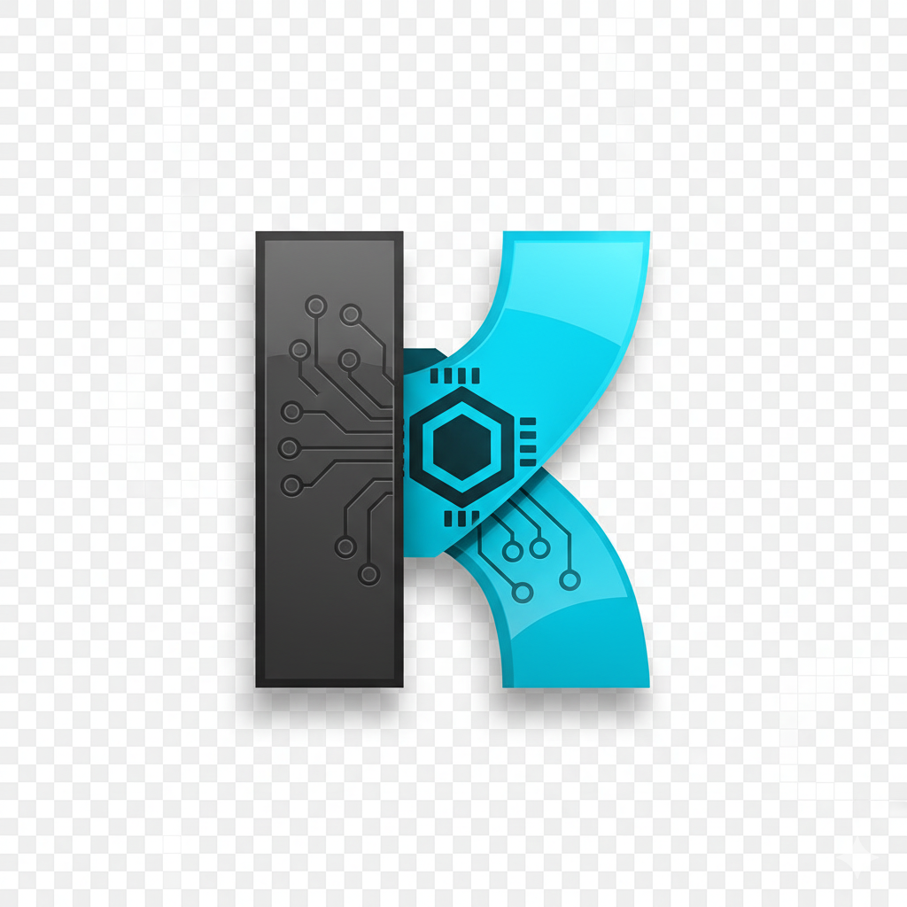

# 🚀 Kratos Data Code - Landing Page

Uma landing page moderna e responsiva para a **Kratos Data Code**, consultoria especializada em desenvolvimento de sistemas e prestação de serviços PJ.



## 🎯 **Sobre o Projeto**

Esta landing page foi desenvolvida com foco em:
- **Design moderno** e **profissional**
- **Experiência do usuário** otimizada
- **Responsividade** para todos os dispositivos
- **Performance** e **acessibilidade**
- **Identidade visual** consistente

## 🛠️ **Tecnologias Utilizadas**

- **React.js 18** - Framework JavaScript
- **CSS3** - Estilização com variáveis customizadas
- **React Icons** - Biblioteca de ícones
- **Responsive Design** - Mobile-first approach
- **Modern JavaScript** (ES6+)

## 🎨 **Paleta de Cores**

### Cores Oficiais da Marca:
- **Primária**: `#2F363F` (Azul Marinho Escuro/Grafite)
- **Secundária**: `#00D4FF` (Ciano Elétrico) 
- **Apoio**: `#2C2C2C` (Cinza Neutro Escuro)
- **Accent Green**: `#10b981` (Verde Esmeralda)

## 📱 **Seções da Landing Page**

### 🏠 **Header**
- Logo integrada com navegação responsiva
- Menu mobile com animações suaves
- Efeito de scroll com background blur

### 🌟 **Hero**
- Apresentação impactante da empresa
- Call-to-action estratégico
- Estatísticas em tempo real
- Gradiente de marca personalizado

### 🔧 **Serviços**
- 8 serviços principais detalhados
- Cards interativos com hover effects
- Tecnologias e ferramentas destacadas
- Grid responsivo

### 👥 **Sobre**
- História e valores da empresa
- Benefícios competitivos
- Estatísticas de performance
- Grid de valores corporativos

### 💼 **Portfólio**
- Projetos desenvolvidos
- Filtros por categoria (Web, Mobile, Sistemas)
- Links para projetos e repositórios
- Tecnologias utilizadas

### 📞 **Contato**
- Formulário funcional
- Informações de contato
- Links para redes sociais
- Validação de campos

### 🦶 **Footer**
- Links organizados
- Newsletter
- Redes sociais
- Informações legais

## 🚀 **Instalação e Execução**

### Pré-requisitos
- Node.js (versão 16 ou superior)
- npm ou yarn

### Passos para execução:

1. **Clone o repositório:**
```bash
git clone [URL_DO_REPOSITORIO]
cd kratos_data_code
```

2. **Instale as dependências:**
```bash
npm install
```

3. **Execute o projeto:**
```bash
npm start
```

4. **Acesse no navegador:**
```
http://localhost:3000
```

## 📦 **Scripts Disponíveis**

- `npm start` - Executa em modo de desenvolvimento
- `npm run build` - Gera build de produção
- `npm test` - Executa os testes
- `npm run eject` - Ejeta a configuração (irreversível)

## 🎯 **Funcionalidades**

### ✨ **Interatividade**
- Scroll suave entre seções
- Animações CSS personalizadas
- Hover effects elegantes
- Transições fluidas

### 📱 **Responsividade**
- Design mobile-first
- Breakpoints otimizados
- Imagens responsivas
- Menu mobile funcional

### 🎨 **Visual**
- Logo com borda elegante
- Gradientes da marca
- Sombras coloridas
- Tipografia moderna

### 🔧 **Técnico**
- Código limpo e organizado
- Componentes reutilizáveis
- CSS modular
- Performance otimizada

## 📂 **Estrutura do Projeto**

```
src/
├── components/
│   ├── Header.js & Header.css
│   ├── Hero.js & Hero.css
│   ├── Services.js & Services.css
│   ├── About.js & About.css
│   ├── Portfolio.js & Portfolio.css
│   ├── Contact.js & Contact.css
│   └── Footer.js & Footer.css
├── styles/
│   ├── index.css (variáveis globais)
│   └── App.css (utilitários)
├── App.js (componente principal)
└── index.js (entry point)

public/
├── assets/img/logo.png
├── index.html
└── manifest.json
```

## 🎨 **Customização**

### Alterando Cores:
Edite as variáveis CSS em `src/styles/index.css`:
```css
:root {
  --primary-color: #2F363F;
  --secondary-color: #00D4FF;
  --support-color: #2C2C2C;
}
```

### Adicionando Conteúdo:
- **Serviços**: Edite array em `src/components/Services.js`
- **Projetos**: Modifique array em `src/components/Portfolio.js`
- **Contatos**: Atualize dados em `src/components/Contact.js`

## 🌐 **Deploy**

### Build de Produção:
```bash
npm run build
```

### Plataformas Recomendadas:
- **Vercel** - Deploy automático
- **Netlify** - Deploy contínuo
- **GitHub Pages** - Hospedagem gratuita
- **AWS S3** - Escalabilidade

## 🤝 **Contribuição**

1. Faça um fork do projeto
2. Crie uma branch para sua feature (`git checkout -b feature/nova-funcionalidade`)
3. Commit suas mudanças (`git commit -m 'feat: adiciona nova funcionalidade'`)
4. Push para a branch (`git push origin feature/nova-funcionalidade`)
5. Abra um Pull Request

## 📝 **Conventional Commits**

Este projeto segue o padrão [Conventional Commits](https://www.conventionalcommits.org/):

- `feat:` - Nova funcionalidade
- `fix:` - Correção de bug
- `docs:` - Documentação
- `style:` - Formatação/estilo
- `refactor:` - Refatoração
- `test:` - Testes
- `chore:` - Tarefas de manutenção

## 📄 **Licença**

Este projeto está sob a licença [MIT](LICENSE).

## 📞 **Contato**

**Kratos Data Code**
- 📧 Email: contato@kratosdatacode.com
- 📱 WhatsApp: +55 (11) 99999-9999
- 🌐 Website: [kratosdatacode.com](https://kratosdatacode.com)
- 💼 LinkedIn: [company/kratosdatacode](https://linkedin.com/company/kratosdatacode)

---

<div align="center">

**Desenvolvido com ❤️ pela equipe Kratos Data Code**

*Transformando ideias em soluções digitais inovadoras*

</div>